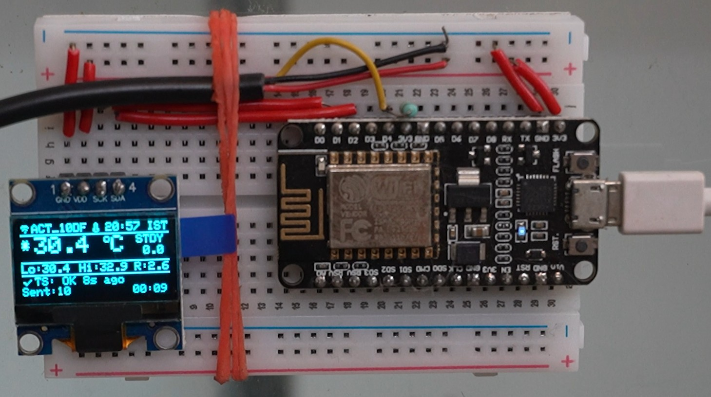

<div align="center">

  

  <h1>Water Temperature Monitor 🌡️🐟</h1>

  <p>
    A Wi-Fi enabled aquarium water-temperature monitor built around a
    <strong>NodeMCU ESP8266</strong>, <strong>DS18B20 waterproof temperature sensor</strong>,
    and <strong>0.91" I²C OLED display</strong>.
  </p>

</div>

> 🌐 **Web dashboard (after GitHub Pages is enabled):**
> [Open the AKuarium dashboard](https://ad1mohan.github.io/AKuarium-Water-Temperature-Monitor/website/)


## 📸 Project



*The completed breadboard prototype of the AKuarium water-temperature
monitor.*

The setup combines the **NodeMCU ESP8266**, **DS18B20 waterproof
temperature sensor**, **I²C OLED display**, and the required **4.7kΩ
pull-up resistor** into a compact aquarium monitoring system.


------------------------------------------------------------------------

## ✨ Features

-   🌡️ Reads aquarium water temperature using a **DS18B20**
-   📺 Displays temperature and system information on a **128×64 I²C
    OLED**
-   📶 Connects to Wi-Fi using the ESP8266
-   ☁️ Uploads temperature readings to **ThingSpeak**
-   ⏱️ Reads the sensor every **5 seconds**
-   ☁️ Sends data to ThingSpeak every **60 seconds**
-   🕐 Displays time in **IST (UTC+5:30)**
-   📊 Tracks:
    -   Current temperature
    -   Minimum temperature
    -   Maximum temperature
    -   Temperature range
    -   ThingSpeak upload count
    -   Upload errors
    -   System uptime
-   ❤️ Shows a normal-temperature status when the temperature is between
    **24°C and 28°C**
-   ⚠️ Detects invalid DS18B20 readings and reports sensor errors
-   🔄 Attempts to reconnect to Wi-Fi if the connection is lost
-   🚀 Includes a custom boot screen and VERDANT / AKuarium branding

The firmware reads the DS18B20 every 5 seconds and attempts a ThingSpeak
upload every 60 seconds. fileciteturn0file0L44-L57

------------------------------------------------------------------------

## 🧩 Hardware Required

```
  Component                                    Quantity
  --------------------------------------- -------------
  NodeMCU ESP8266                                     1
  DS18B20 Waterproof Temperature Sensor               1
  0.91" / 0.96" I²C OLED Display                      1
  4.7kΩ Resistor                                      1
  Breadboard                                          1
  Male-to-Male Jumper Wires                 As required
  Micro-USB Cable                                     1
```

The firmware is configured for an ESP8266, DS18B20, and OLED display.

------------------------------------------------------------------------

## 🔌 Wiring

### DS18B20 → NodeMCU
```
  DS18B20 Wire        NodeMCU
  ------------------- ----------------
  Red (VCC)       3.3V
  Black (GND)     GND
  Yellow (DATA)   D4 / GPIO2
```

A **4.7kΩ pull-up resistor** is required between the DS18B20 DATA line
and 3.3V.

The firmware uses **D4** as the OneWire bus pin.

### OLED → NodeMCU
```
  OLED Pin   NodeMCU
  ---------- ----------------
  VCC    3.3V
  GND    GND
  SCL    D1 / GPIO5
  SDA    D2 / GPIO4
```

The OLED is configured for I²C address **0x3C**.

------------------------------------------------------------------------

## 🖥️ OLED Display

The main OLED screen provides several pieces of information at once:

```
┌──────────────────────────────┐
│ WiFi  SSID   🌡  HH:MM IST   │
├──────────────────────────────┤
│ ❤️       27.4°C             |
├──────────────────────────────┤
│ Lo:xx.x  Hi:xx.x  R:x.x      │
├──────────────────────────────┤
│ TS: OK 30s ago               │
│ Sent:12 Err:0       00:25    │
└──────────────────────────────┘
```

The firmware uses the top bar for Wi-Fi, SSID, sensor status, and IST
time, followed by the large temperature reading, statistics, and
ThingSpeak status.

If the DS18B20 reports an error, the OLED displays a sensor-error
message and asks the user to check the wiring.

------------------------------------------------------------------------

## ☁️ ThingSpeak

Temperature data is uploaded to ThingSpeak using:

``` text
field1 = temperature
```

The firmware sends the temperature value with two decimal places and
records successful and failed uploads. 

The upload interval is set to **60 seconds**.

------------------------------------------------------------------------

## 🌐 Web Dashboard

The repository includes a polished, static **AKuarium Aqua Temp Monitor**
dashboard in [`website/`](website/). It reads a public ThingSpeak channel
directly in the browser—there is no backend, account, or ThingSpeak Write API
key involved.

The dashboard:

- accepts a public ThingSpeak Channel ID
- reads **Field 1** temperature history directly from the ThingSpeak REST API
- displays the latest temperature, timestamp, minimum, maximum, average, and
  valid-reading count
- retrieves history in 8,000-record API chunks so **All Time** is not limited
  to a single ThingSpeak response
- provides 24-hour, 7-day, 30-day, and All Time graph views
- supports chart hover details, zooming, panning, and a five-minute optional
  auto refresh
- handles invalid IDs, private channels, empty data, network failures, and
  invalid Field 1 values with clear messages
- is designed for desktop, tablet, and mobile use on GitHub Pages

### Using the dashboard

1. Open the [AKuarium dashboard](https://ad1mohan.github.io/AKuarium-Water-Temperature-Monitor/website/) after deploying GitHub Pages.
2. Enter a public **ThingSpeak Channel ID**.
3. Select **Load Channel** (or press Enter).
4. Choose **24 Hours**, **7 Days**, **30 Days**, or **All Time**.
5. Explore the graph, hover a reading for its exact time and temperature, and
   optionally leave auto refresh enabled.

### Publish with GitHub Pages

GitHub Pages can publish this repository without a build step. In GitHub, open
**Settings → Pages**, then under **Build and deployment** choose **Deploy from
a branch**. Select the `main` branch and the `/ (root)` folder, then save.

Because the dashboard is intentionally kept in the `website/` folder to leave
the Arduino project untouched, its published address is:

``` text
https://ad1mohan.github.io/AKuarium-Water-Temperature-Monitor/website/
```

After the first deployment finishes, GitHub will show the same link in the
Pages settings. The page uses relative asset paths, so it works under the
repository's GitHub Pages project URL.

### Data flow

``` text
ESP8266
   │
   │ Wi-Fi
   ▼
ThingSpeak
   │
   │ REST API (public Field 1 reads)
   ▼
AKuarium Web Dashboard
   │
   ▼
GitHub Pages
```

The Arduino code runs on the ESP8266, ThingSpeak stores the cloud data, and
the static website reads those public readings when a visitor supplies a
channel ID. GitHub Pages only hosts the website files.

------------------------------------------------------------------------

## 🛠️ Arduino IDE Setup

### 1. Install Arduino IDE

Download and install the Arduino IDE on your computer.

### 2. Add ESP8266 Board Support

In Arduino IDE:

``` text
File
  → Preferences
  → Additional Boards Manager URLs
```

Add the ESP8266 Boards Manager URL:

``` text
https://arduino.esp8266.com/stable/package_esp8266com_index.json
```

Then open:

``` text
Tools
  → Board
  → Boards Manager
```

Search for:

``` text
esp8266
```

Install the **ESP8266** board package.

### 3. Select the Board

Connect the NodeMCU to the computer using USB.

Then select the appropriate ESP8266 board. For a typical NodeMCU ESP8266
development board, this is commonly:

``` text
NodeMCU 1.0 (ESP-12E Module)
```

Also select the COM port that appears when the NodeMCU is connected.

### 4. Test the NodeMCU

Before uploading the aquarium monitor firmware, it is useful to test the
board using the built-in Blink example:

``` text
File
  → Examples
  → 01.Basics
  → Blink
```

Upload the sketch and verify that the onboard LED blinks.

This confirms that the Arduino IDE, ESP8266 board package, USB
connection, and selected COM port are working.

------------------------------------------------------------------------

## 📦 Required Libraries

Install the following libraries through the Arduino Library Manager:

-   **OneWire**
-   **DallasTemperature**
-   **Adafruit GFX Library**
-   **Adafruit SSD1306**

The project also uses ESP8266 Wi-Fi/HTTP functionality and the standard
Arduino `Wire` and time functionality. 

### Library overview
```
  Library             Purpose
  ------------------- -----------------------------
  ESP8266WiFi         Wi-Fi connection
  ESP8266HTTPClient   HTTP communication
  OneWire             DS18B20 communication
  DallasTemperature   Temperature sensor handling
  Wire                I²C communication
  Adafruit GFX        Graphics/text drawing
  Adafruit SSD1306    OLED control
  time                Network time / IST clock
```
------------------------------------------------------------------------

## 📁 Project Structure

``` text
AKuarium-Water-Temperature-Sensor/
│
├── README.md
│
├── AK_Thingspeak/
│   └── AK_Thingspeak.ino
│
├── images/
│   ├── channel-logo.svg
│   └── poc.jpg
│   
│
├── website/
│   ├── index.html       # GitHub Pages dashboard markup
│   ├── style.css        # responsive aquarium-themed styling
│   └── script.js        # public ThingSpeak API client and chart logic
│
└── LICENSE
```

Third-party Arduino libraries are **not included in this repository**.
Install them through the Arduino IDE Library Manager instead.

The sketch under `AK_Thingspeak/` runs on the ESP8266. ThingSpeak receives
the cloud data, and `website/` is a separate, static read-only dashboard that
GitHub Pages can host without changing the firmware.

------------------------------------------------------------------------

## 🔐 Configure Your Wi-Fi and ThingSpeak

Before uploading the firmware, configure your own credentials in the
`.ino` file.

Use placeholders like:

``` cpp
const char* WIFI_SSID     = "YOUR_WIFI_SSID";
const char* WIFI_PASSWORD = "YOUR_WIFI_PASSWORD";

const char* TS_API_KEY    = "YOUR_THINGSPEAK_API_KEY";
```

------------------------------------------------------------------------

## 🌡️ Temperature Safety Range

The current firmware uses:

``` cpp
#define TEMP_SAFE_LOW   24.0
#define TEMP_SAFE_HIGH  28.0
```

Therefore:

-   Below **24°C** → cold status
-   **24°C to 28°C** → normal / healthy status
-   Above **28°C** → hot status

The OLED changes its temperature-status icon based on these thresholds.

These values are project settings and can be changed in the firmware
according to the requirements of the aquarium.

------------------------------------------------------------------------

## 🔄 How It Works

``` text
             ┌─────────────────┐
             │   DS18B20       │
             │ Temperature     │
             │ Sensor          │
             └────────┬────────┘
                      │
                      │ D4
                      ▼
             ┌─────────────────┐
             │    NodeMCU      │
             │    ESP8266      │
             └───────┬─┬───────┘
                     │ │
              I²C    │ │ Wi-Fi
                     │ │
             ┌───────▼─┐ └──────────────┐
             │  OLED   │                │
             │ Display │                ▼
             └─────────┘        ┌────────────────┐
                                │   ThingSpeak   │
                                │ Cloud Logging  │
                                └────────────────┘
```

The main loop periodically reads the temperature, uploads it to
ThingSpeak when the upload interval is reached, and refreshes the OLED
display. 

------------------------------------------------------------------------

## 🚀 Uploading the Project

1.  Install Arduino IDE.
2.  Install the ESP8266 board package.
3.  Install the required libraries.
4.  Open:

``` text
AK_Thingspeak/AK_Thingspeak.ino
```

5.  Enter your own Wi-Fi credentials.
6.  Enter your ThingSpeak API key.
7.  Select the NodeMCU board.
8.  Select the correct COM port.
9.  Click **Upload**.
10. Open Serial Monitor to observe the startup and ThingSpeak upload
    messages.

On startup, the firmware shows the AK logo, VERDANT branding, and a
progress sequence before entering the main monitoring screen.

------------------------------------------------------------------------

## 🎥 YouTube

This project is part of the **AKuarium** project series.

The build can be followed from:

**Hardware → Wiring → Arduino IDE setup → Blink test → Firmware upload →
ThingSpeak → Final monitoring**
